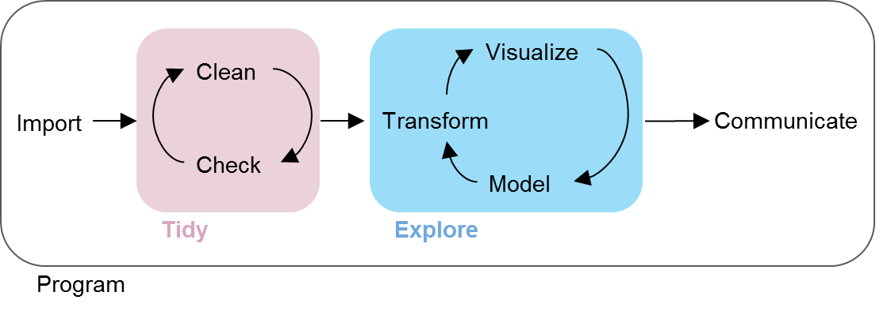

In their most excellent book, [R for Data Science](http://r4ds.had.co.nz/index.html), Garret Grolemund and Hadley Wickham introduce the following graphic to illustrate the data science process.

_R for Data Science_ focuses almost entirely on the *Explore* aspect of Data Science, also known as "The Fun Part". This package is about the 80% of a Data Scientist's work -- the tidying up of messy data.

Data tidying is an iterative process of *Cleaning* and *Checking*. This package offers the authors' perspective on how that *Cleaning* and *Checking* should be approached. It is by no means the "right" perspective, and there are many other worthy resources (TODO: insert link to a separate section on recommended resources).

#Preventing messy data

The best way to fix messy data is to avoid having messy data in the first place.

TODO: 

- Very short discussion of things to think about when working with a data set generated just for your project and links to other resources.
- Potentially a discussion of when to set up a relational database.
- Maybe mention packrat, logging and github in like one sentance with links. Maybe also setting up an organized project.

#Cleaning

Blind cleaning tasks

- Names
- Dates
- Other stuff you know always needs to be changed

#Checking

Automated, "blind" checking

- Unit tests vs runtime checks and using a package like assertr or ensure
- ID vars / keys
- Completeness of key outcomes

Interactive checking tasks

- Using tabyls and charts to actually look at your data

#Cleaning again

You found something wrong. What to do?

- Consider writing tests to make sure it is fixed before correcting
- Tools for cleaning efficiently?

#Utilities

Make this whole process faster by writing little utility functions. Here's a few that we love (utilities that fit in the "other category")

#Packages

A beefed up version of utilities is creating a package to handle all of the load, clean and check tasks, so that you can focus on The Fun Part the next time you pick up the project.

#Questions

- Is this a webpage or a doc?
